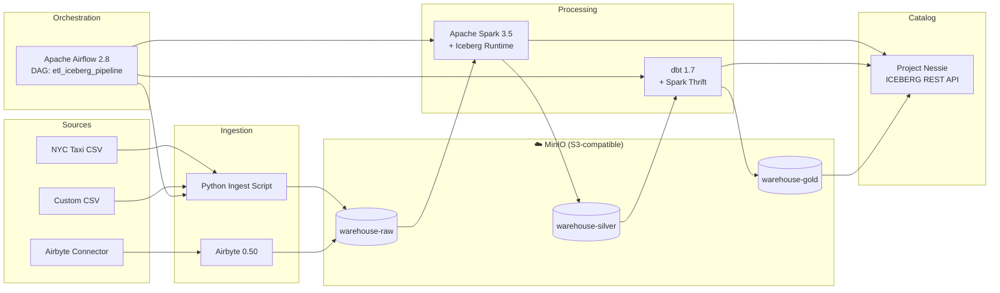
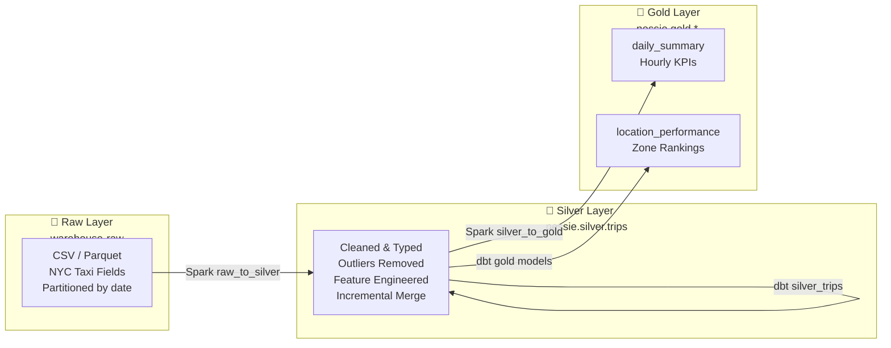
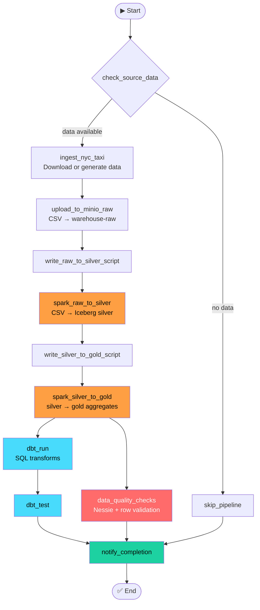
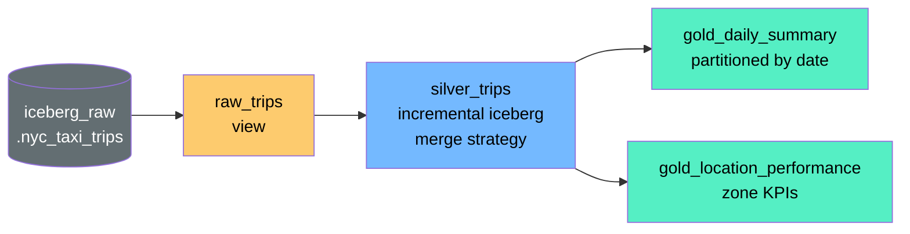
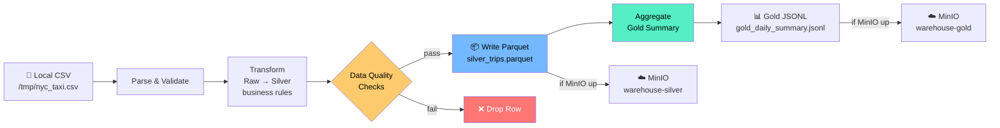

# Local Apache Iceberg ETL Stack

A production-grade local ETL stack built on Apache Iceberg — runs entirely on your laptop or Mac Mini.

## Architecture



---

## Data Flow (Medallion Architecture)



---

## Airflow DAG



---

## dbt Lineage



---

## Local Demo Pipeline (no Docker needed)



---

## Table of Contents

1. [Stack Components](#stack-components)
2. [Prerequisites](#prerequisites)
3. [Quick Start](#quick-start)
4. [Use Cases](#use-cases)
   - [Use Case 1: Full Stack (Docker Compose)](#use-case-1-full-stack-docker-compose)
   - [Use Case 2: Kubernetes with kind](#use-case-2-kubernetes-with-kind)
   - [Use Case 3: Manual Component-by-Component](#use-case-3-manual-component-by-component)
   - [Use Case 4: Python Ingest Only (no Airbyte)](#use-case-4-python-ingest-only-no-airbyte)
   - [Use Case 5: dbt Transformations Only](#use-case-5-dbt-transformations-only)
   - [Use Case 6: Query with Spark Shell](#use-case-6-query-with-spark-shell)
   - [Use Case 7: Nessie Time-Travel & Branching](#use-case-7-nessie-time-travel--branching)
5. [Data Pipeline](#data-pipeline)
6. [Service URLs & Credentials](#service-urls--credentials)
7. [Resource Requirements](#resource-requirements)
8. [Testing](#testing)
9. [Troubleshooting](#troubleshooting)
10. [Known Issues & Workarounds](#known-issues--workarounds)
11. [Project Structure](#project-structure)
12. [Iceberg Features](#iceberg-features)

---

## Stack Components

| Component | Version | Purpose | Port |
|-----------|---------|---------|------|
| **MinIO** | 2024-01-18 | S3-compatible Iceberg warehouse | 9000 / 9001 |
| **Project Nessie** | 0.76.3 | Iceberg REST catalog + Git-like versioning | 19120 |
| **Apache Spark** | 3.5.0 | Distributed processing engine | 7077 / 8090 |
| **Apache Airflow** | 2.8.0 | Pipeline orchestration + scheduling | 8080 |
| **Airbyte** | 0.50.45 | Data ingestion (sources → raw) | 8000 |
| **dbt** | 1.7.2 | SQL transformations (raw → silver → gold) | — |
| **PostgreSQL** | 15 | Airflow metadata store | 5432 |

---

## Prerequisites

### Required for all modes

- **Docker** 24+ with Docker Compose v2 (`docker compose` — note: no hyphen)
- **Python 3.10+** (for synthetic data generation and local scripts)
- **8 GB RAM** minimum (16 GB recommended for full stack)
- **20 GB disk space** free

### Required for Kubernetes mode only

- **kind** v0.20+ — `go install sigs.k8s.io/kind@v0.20.0` or [kind releases](https://github.com/kubernetes-sigs/kind/releases)
- **kubectl** — [install guide](https://kubernetes.io/docs/tasks/tools/)
- **helm** v3 — `brew install helm` or [helm.sh](https://helm.sh)

### Optional but useful

- **AWS CLI v2** — for MinIO bucket inspection (`brew install awscli`)
- **mc (MinIO Client)** — `brew install minio/stable/mc`
- **dbt-spark** — `pip install dbt-spark==1.7.2` (for running dbt locally)

### Check your setup

```bash
docker --version          # ≥ 24.0
docker compose version    # ≥ 2.0
python3 --version         # ≥ 3.10
# Kubernetes only:
kind version
kubectl version --client
helm version
```

---

## Quick Start

```bash
# 1. Clone
git clone <repo-url>
cd opensource_etl_stack

# 2. Copy env and start
cp .env.example .env
./scripts/setup.sh --mode docker

# 3. Verify services are healthy
./scripts/test_pipeline.sh --mode docker

# 4. Open Airflow UI and trigger the pipeline
open http://localhost:8080    # admin / admin123
```

That's it. The full pipeline (ingest → Spark → dbt → gold tables) runs automatically.

---

## Use Cases

---

### Use Case 0: Local Demo (no Docker, runs now)

**Best for:** trying the pipeline instantly, understanding the transform logic, CI without Docker.

**Requirements:** Node.js ≥ 18, `npm install parquetjs-lite` (or runs with JSONL fallback)

#### Step 1 — Install dep (optional, for real Parquet output)

```bash
cd opensource_etl_stack
npm install parquetjs-lite
```

#### Step 2 — Run the demo

```bash
# Generate data + run full pipeline (no MinIO needed)
node scripts/local_etl_demo.js --generate

# Use your own CSV
node scripts/local_etl_demo.js --csv /path/to/your/file.csv

# With MinIO running: also uploads to warehouse-raw / warehouse-silver / warehouse-gold
docker compose up -d minio && docker compose up minio-init
node scripts/local_etl_demo.js --generate
```

#### What it does

1. **Generate** — creates 1,000 synthetic NYC taxi rows (or reads your CSV)
2. **Upload raw** — pushes CSV to `s3://warehouse-raw/nyc_taxi/year=.../month=.../` (if MinIO up)
3. **Transform** — applies all silver business rules: type casting, outlier removal, feature engineering (`time_of_day`, `avg_speed_mph`, `tip_pct`, `fare_per_mile`, etc.)
4. **Data quality checks** — asserts trip_distance, fare_amount, duration all in valid ranges
5. **Write Parquet** — outputs `silver_trips.parquet` (~200 KB for 1k rows)
6. **Upload silver** — pushes Parquet to `s3://warehouse-silver/silver/trips/` (if MinIO up)
7. **Gold aggregation** — computes hourly revenue/trip KPIs
8. **Write gold** — outputs `gold_daily_summary.jsonl`

#### Expected output

```
✓ Generated synthetic CSV: /tmp/nyc_taxi_demo.csv
✓ Parsed 1000 raw rows from CSV
✓ Transformed 1000 rows (filtered 0 bad rows)
✓ DQ: all trip_distance values in range (0–200 mi)
✓ DQ: all fare_amount values in range ($0–$500)
✓ DQ: all trip_duration_minutes in range (0–300 min)
✓ DQ: time_of_day feature correctly computed
✓ Silver file written: /tmp/silver_trips.parquet (198.9 KB)
✓ Gold aggregation: 509 hourly buckets across 28 days
✓ Total trips: 1,000
✓ Total revenue: $44,262.56
✓ Gold file written: /tmp/gold_daily_summary.jsonl

✅ Pipeline complete!  Passed: 13  Failed: 0  Skipped: 2
```

---

### Use Case 1: Full Stack (Docker Compose)

**Best for:** local development, demos, first-time setup.

**RAM needed:** ~8 GB

#### Step 1 — Prepare environment

```bash
cd opensource_etl_stack
cp .env.example .env
# Edit .env if you want custom MinIO credentials or passwords
```

#### Step 2 — Start everything

```bash
./scripts/setup.sh --mode docker
```

This script:
1. Pulls all Docker images
2. Starts MinIO + Nessie + Postgres
3. Initializes MinIO buckets (`warehouse`, `warehouse-raw`, `warehouse-silver`, `warehouse-gold`)
4. Starts Spark master + worker
5. Initializes Airflow DB and creates admin user
6. Starts Airflow webserver + scheduler
7. Starts Airbyte server + webapp
8. Waits for all health checks to pass

**Expected time:** 3–10 minutes on first run (image downloads), 60–90 seconds on subsequent runs.

#### Step 3 — Open the UIs

| Service | URL | Login |
|---------|-----|-------|
| Airflow | http://localhost:8080 | admin / admin123 |
| MinIO Console | http://localhost:9001 | minioadmin / minioadmin123 |
| Airbyte | http://localhost:8000 | airbyte / password |
| Spark UI | http://localhost:8090 | — |
| Nessie API | http://localhost:19120/api/v1 | — |

#### Step 4 — Trigger the pipeline

**Via Airflow UI:**
1. Go to http://localhost:8080
2. Find `etl_iceberg_pipeline` DAG
3. Toggle it ON (it's paused by default)
4. Click ▶ "Trigger DAG"
5. Watch the graph view — tasks turn green as they complete

**Via CLI:**
```bash
docker compose exec airflow-webserver airflow dags trigger etl_iceberg_pipeline
```

#### Step 5 — Verify results

```bash
# Check Nessie tables
curl http://localhost:19120/api/v1/trees/tree/main/entries

# Check raw data in MinIO
docker compose exec minio-init mc ls local/warehouse-raw/nyc_taxi/

# Query silver table via Spark
docker compose exec spark-master pyspark --packages \
  org.apache.iceberg:iceberg-spark-runtime-3.5_2.12:1.4.3,...
# Then: spark.table("nessie.silver.trips").count()
```

#### Tear down

```bash
docker compose down          # stop, keep volumes
docker compose down -v       # stop and delete ALL data
```

---

### Use Case 2: Kubernetes with kind

**Best for:** testing production-like deployments, CI/CD, learning k8s.

**RAM needed:** ~12 GB (kind cluster overhead + all services)

#### Prerequisites check

```bash
kind version    # should show v0.20+
kubectl version --client
helm version
```

#### Step 1 — Start the kind cluster + deploy

```bash
./scripts/setup.sh --mode k8s
```

This creates a kind cluster named `etl-stack`, applies all manifests from `k8s/`, waits for deployments, and uploads Airflow DAGs.

#### Step 2 — Verify all pods are running

```bash
kubectl get pods --all-namespaces
# Expected: all pods in Running or Completed state
```

#### Step 3 — Port-forward to access services

```bash
# MinIO
kubectl port-forward -n minio svc/minio 9000:9000 9001:9001 &

# Nessie
kubectl port-forward -n nessie svc/nessie 19120:19120 &

# Airflow
kubectl port-forward -n airflow svc/airflow-webserver 8080:8080 &

# Spark
kubectl port-forward -n spark svc/spark-master-ui 8090:8090 &
```

> **Note:** The k8s manifests use `NodePort` for kind, so if port-forwards don't work, check NodePort assignments with `kubectl get svc --all-namespaces`.

#### Step 4 — Trigger the pipeline

```bash
AIRFLOW_POD=$(kubectl get pod -n airflow -l component=webserver -o jsonpath='{.items[0].metadata.name}')
kubectl exec -n airflow $AIRFLOW_POD -- airflow dags trigger etl_iceberg_pipeline
```

#### Step 5 — Watch logs

```bash
kubectl logs -n airflow deployment/airflow-scheduler -f
kubectl logs -n spark deployment/spark-master -f
kubectl logs -n nessie deployment/nessie -f
```

#### Tear down

```bash
kind delete cluster --name etl-stack
```

---

### Use Case 3: Manual Component-by-Component

**Best for:** debugging, starting only what you need, understanding each piece.

#### Step 1 — MinIO (storage layer)

```bash
docker compose up -d minio
docker compose up minio-init   # creates the buckets
```

Verify:
```bash
curl http://localhost:9000/minio/health/live
# → 200 OK
```

#### Step 2 — Nessie (catalog)

```bash
docker compose up -d nessie
```

Verify:
```bash
curl http://localhost:19120/q/health/ready
curl http://localhost:19120/api/v1/trees/tree/main
# → JSON with "name": "main"
```

#### Step 3 — Spark (processing)

```bash
docker compose up -d spark-master spark-worker
```

Verify: http://localhost:8090 shows 1 worker connected.

#### Step 4 — Postgres (Airflow metadata)

```bash
docker compose up -d postgres
```

#### Step 5 — Airflow

```bash
docker compose run --rm airflow-init   # one-time DB init + user creation
docker compose up -d airflow-webserver airflow-scheduler
```

Verify: http://localhost:8080 (admin / admin123)

#### Step 6 — Airbyte (optional — only needed for Airbyte ingest)

```bash
docker compose up -d airbyte-db airbyte-server airbyte-webapp
```

⚠️ Airbyte needs ~2–3 minutes to fully start and uses ~1.5 GB RAM.

#### Step 7 — Spark Thrift Server (only needed for dbt)

```bash
docker compose up -d spark-thrift
```

⚠️ This takes 3–5 minutes to start (downloads Iceberg/Nessie JARs on first run).

---

### Use Case 4: Python Ingest Only (no Airbyte)

**Best for:** quick testing, when you have your own CSV/Parquet data.

#### Step 1 — Generate sample data

```bash
python3 sample_data/generate_sample_data.py --rows 10000 --output /tmp/nyc_taxi.csv

# Or a specific month:
python3 sample_data/generate_sample_data.py \
    --rows 50000 \
    --year 2024 \
    --month 3 \
    --output /tmp/nyc_taxi_2024_03.csv
```

#### Step 2 — Upload to MinIO raw bucket

Make sure MinIO is running (`docker compose up -d minio && docker compose up minio-init`), then:

```bash
# Using AWS CLI
AWS_ACCESS_KEY_ID=minioadmin \
AWS_SECRET_ACCESS_KEY=minioadmin123 \
aws s3 cp /tmp/nyc_taxi.csv \
    s3://warehouse-raw/nyc_taxi/year=2024/month=01/nyc_taxi.csv \
    --endpoint-url http://localhost:9000 \
    --region us-east-1

# Or using mc
mc alias set local http://localhost:9000 minioadmin minioadmin123
mc cp /tmp/nyc_taxi.csv local/warehouse-raw/nyc_taxi/year=2024/month=01/
```

#### Step 3 — Run Spark transformation (raw → silver)

Make sure Spark + Nessie + MinIO are running, then:

```bash
docker compose exec spark-master spark-submit \
    --master spark://spark-master:7077 \
    --packages org.apache.iceberg:iceberg-spark-runtime-3.5_2.12:1.4.3,\
org.projectnessie.nessie-integrations:nessie-spark-extensions-3.5_2.12:0.76.3,\
org.apache.hadoop:hadoop-aws:3.3.4,\
com.amazonaws:aws-java-sdk-bundle:1.12.262 \
    --conf spark.sql.extensions=org.apache.iceberg.spark.extensions.IcebergSparkSessionExtensions \
    --conf spark.sql.catalog.nessie=org.apache.iceberg.spark.SparkCatalog \
    --conf spark.sql.catalog.nessie.catalog-impl=org.apache.iceberg.nessie.NessieCatalog \
    --conf spark.sql.catalog.nessie.uri=http://nessie:19120/api/v1 \
    --conf spark.sql.catalog.nessie.ref=main \
    --conf spark.sql.catalog.nessie.warehouse=s3://warehouse/ \
    --conf spark.hadoop.fs.s3a.endpoint=http://minio:9000 \
    --conf spark.hadoop.fs.s3a.access.key=minioadmin \
    --conf spark.hadoop.fs.s3a.secret.key=minioadmin123 \
    --conf spark.hadoop.fs.s3a.path.style.access=true \
    /path/to/raw_to_silver.py
```

#### Step 4 — Verify the silver table

```bash
curl http://localhost:19120/api/v1/trees/tree/main/entries \
    | python3 -m json.tool | grep -A2 "silver"
```

---

### Use Case 5: dbt Transformations Only

**Best for:** when data is already in MinIO/Nessie and you only want to run SQL transforms.

**Requires:** Spark Thrift Server running.

#### Step 1 — Start Spark Thrift

```bash
docker compose up -d minio nessie spark-master spark-worker
docker compose up -d spark-thrift
# Wait ~5 min for JARs to download on first run
```

#### Step 2 — Verify Thrift Server is up

```bash
# Port 10001 should be listening
nc -zv localhost 10001
```

#### Step 3 — Run dbt models

```bash
# Full run
docker compose run --rm dbt dbt run \
    --profiles-dir /opt/dbt \
    --project-dir /opt/dbt \
    --target docker

# Single model
docker compose run --rm dbt dbt run \
    --profiles-dir /opt/dbt \
    --select silver_trips

# Run tests
docker compose run --rm dbt dbt test \
    --profiles-dir /opt/dbt

# Generate + serve docs
docker compose run --rm dbt dbt docs generate --profiles-dir /opt/dbt
docker compose run --rm dbt dbt docs serve --profiles-dir /opt/dbt --port 8585
```

#### Step 4 — Run locally (without Docker)

```bash
pip install dbt-spark==1.7.2 PyHive thrift

cd dbt/
dbt debug --profiles-dir . --target docker    # verify connection
dbt run   --profiles-dir . --target docker    # run models
dbt test  --profiles-dir . --target docker    # run tests
```

#### dbt Model Lineage

```
sources.iceberg_raw.nyc_taxi_trips
    └── raw_trips (view)
            └── silver_trips (incremental iceberg, merge strategy)
                    ├── gold_daily_summary (iceberg table, partitioned by date)
                    └── gold_location_performance (iceberg table)
```

---

### Use Case 6: Query with Spark Shell

**Best for:** ad-hoc analysis, debugging, exploring tables.

#### Interactive PySpark shell

```bash
docker compose exec spark-master pyspark \
    --master spark://spark-master:7077 \
    --packages org.apache.iceberg:iceberg-spark-runtime-3.5_2.12:1.4.3,\
org.projectnessie.nessie-integrations:nessie-spark-extensions-3.5_2.12:0.76.3,\
org.apache.hadoop:hadoop-aws:3.3.4,\
com.amazonaws:aws-java-sdk-bundle:1.12.262 \
    --conf spark.sql.extensions=org.apache.iceberg.spark.extensions.IcebergSparkSessionExtensions \
    --conf spark.sql.catalog.nessie=org.apache.iceberg.spark.SparkCatalog \
    --conf spark.sql.catalog.nessie.catalog-impl=org.apache.iceberg.nessie.NessieCatalog \
    --conf spark.sql.catalog.nessie.uri=http://nessie:19120/api/v1 \
    --conf spark.sql.catalog.nessie.ref=main \
    --conf spark.sql.catalog.nessie.warehouse=s3://warehouse/ \
    --conf spark.hadoop.fs.s3a.endpoint=http://minio:9000 \
    --conf spark.hadoop.fs.s3a.access.key=minioadmin \
    --conf spark.hadoop.fs.s3a.secret.key=minioadmin123 \
    --conf spark.hadoop.fs.s3a.path.style.access=true
```

#### Useful queries

```python
# List all namespaces/tables
spark.sql("SHOW NAMESPACES IN nessie").show()
spark.sql("SHOW TABLES IN nessie.silver").show()
spark.sql("SHOW TABLES IN nessie.gold").show()

# Row counts
spark.table("nessie.silver.trips").count()
spark.table("nessie.gold.daily_summary").count()

# Sample data
spark.table("nessie.silver.trips").show(10, truncate=False)

# Revenue by day
spark.sql("""
    SELECT pickup_date, SUM(total_amount) as revenue, COUNT(*) as trips
    FROM nessie.silver.trips
    GROUP BY pickup_date
    ORDER BY pickup_date
""").show(30)

# Top pickup zones
spark.sql("""
    SELECT pu_location_id, COUNT(*) as pickups, AVG(total_amount) as avg_fare
    FROM nessie.silver.trips
    GROUP BY pu_location_id
    ORDER BY pickups DESC
    LIMIT 20
""").show()

# Time-travel: query yesterday's snapshot
spark.sql("""
    SELECT * FROM nessie.silver.trips
    FOR SYSTEM_TIME AS OF '2024-01-15 12:00:00'
    LIMIT 5
""").show()

# Iceberg table metadata
spark.sql("SELECT * FROM nessie.silver.trips.snapshots").show()
spark.sql("SELECT * FROM nessie.silver.trips.files LIMIT 5").show()
```

#### Spark SQL shell (non-Python)

```bash
docker compose exec spark-master spark-sql \
    --conf spark.sql.catalog.nessie=org.apache.iceberg.spark.SparkCatalog \
    --conf spark.sql.catalog.nessie.catalog-impl=org.apache.iceberg.nessie.NessieCatalog \
    --conf spark.sql.catalog.nessie.uri=http://nessie:19120/api/v1
```

---

### Use Case 7: Nessie Time-Travel & Branching

**Best for:** safe experimentation, A/B testing transforms, schema changes.

#### List branches and tags

```bash
curl -s http://localhost:19120/api/v1/trees | python3 -m json.tool
```

#### Create a feature branch

```python
import requests

BASE = "http://localhost:19120/api/v1"

# Get main branch hash
main = requests.get(f"{BASE}/trees/tree/main").json()
main_hash = main["hash"]

# Create feature branch
requests.post(f"{BASE}/trees/tree", json={
    "name": "feature/new-gold-model",
    "type": "BRANCH",
    "hash": main_hash,
    "sourceRefName": "main"
}).raise_for_status()

print("Branch created: feature/new-gold-model")
```

#### Use a branch in Spark

```python
# Point Spark at a specific branch
spark.conf.set("spark.sql.catalog.nessie.ref", "feature/new-gold-model")

# Now all writes go to the feature branch
new_gold.writeTo("nessie.gold.new_model").using("iceberg").createOrReplace()

# Merge: delete branch (manual merge via Nessie API)
# In production, use Nessie merge API
```

#### Time-travel with Spark

```python
# By timestamp
spark.read.format("iceberg") \
    .option("as-of-timestamp", "2024-01-15T12:00:00.000+00:00") \
    .load("nessie.silver.trips") \
    .count()

# By snapshot ID (get from .snapshots table)
snapshots = spark.sql("SELECT * FROM nessie.silver.trips.snapshots").collect()
snapshot_id = snapshots[-2]["snapshot_id"]  # second-to-last snapshot

spark.read.format("iceberg") \
    .option("snapshot-id", snapshot_id) \
    .load("nessie.silver.trips") \
    .count()
```

#### Expire old snapshots (cleanup)

```bash
# Triggered by the iceberg_maintenance DAG (runs weekly)
# Or manually:
docker compose exec airflow-webserver \
    airflow dags trigger iceberg_maintenance_dag
```

---

## Data Pipeline

### Raw Layer (MinIO `warehouse-raw`)

- Raw CSV / Parquet files from NYC Taxi dataset
- Partitioned by `year=YYYY/month=MM/`
- Loaded by Airbyte connector OR Python ingest script
- Format: flat CSV with original taxi column names

### Silver Layer (`nessie.silver.trips`)

- Cleaned, typed, feature-engineered Iceberg table
- Incremental merge strategy (upsert on `vendor_id + pickup_datetime + pu_location_id`)
- Partitioned by day (`pickup_date`)
- Added fields: `trip_duration_minutes`, `time_of_day`, `avg_speed_mph`, `tip_pct`, `fare_per_mile`, `day_name`, `is_weekend`, `payment_type_label`
- Business rules applied: distance 0.1–200 mi, fare $1–500, duration 1–300 min

### Gold Layer (`nessie.gold.*`)

| Table | Grain | Key Metrics |
|-------|-------|-------------|
| `gold_daily_summary` | day + hour | trip_count, revenue, avg_fare, avg_distance, avg_duration, peak_hour flag |
| `gold_location_performance` | location | trips per zone, avg revenue, rank |

---

## Service URLs & Credentials

| Service | URL | User | Password |
|---------|-----|------|----------|
| MinIO Console | http://localhost:9001 | minioadmin | minioadmin123 |
| MinIO API | http://localhost:9000 | — | — |
| Nessie REST API | http://localhost:19120/api/v1 | — | — |
| Airflow UI | http://localhost:8080 | admin | admin123 |
| Airbyte UI | http://localhost:8000 | airbyte | password |
| Spark Master UI | http://localhost:8090 | — | — |
| Spark Worker UI | http://localhost:8091 | — | — |
| Spark Thrift | localhost:10001 | — | — |
| PostgreSQL | localhost:5432 | airflow | airflow123 |

> ⚠️ **Security note:** All passwords are defaults for local dev only. Change them in `.env` before exposing on a network.

---

## Resource Requirements

| Mode | Min RAM | Recommended RAM | Disk |
|------|---------|-----------------|------|
| Full Docker Compose | 8 GB | 12 GB | 10 GB |
| Without Airbyte | 6 GB | 8 GB | 8 GB |
| Without Airbyte + Thrift | 4 GB | 6 GB | 6 GB |
| Kubernetes (kind) | 12 GB | 16 GB | 15 GB |
| dbt only (local) | 2 GB | 4 GB | 2 GB |

### Per-service limits (Docker Compose)

| Service | Memory Limit | CPU Limit |
|---------|-------------|-----------|
| MinIO | 1 GB | 1.0 |
| Nessie | 1 GB | 1.0 |
| Spark Master | 1 GB | 1.0 |
| Spark Worker | 2.5 GB | 2.0 |
| Spark Thrift | 2 GB | 2.0 |
| Airflow Webserver | 1 GB | 1.0 |
| Airflow Scheduler | 1 GB | 1.0 |
| PostgreSQL | 512 MB | 0.5 |
| Airbyte Server | 1 GB | 1.0 |
| **Total** | **~11 GB** | **~11** |

### Reduce RAM usage (8 GB laptop)

Edit `docker-compose.yml`:
```yaml
# Option A: Disable Airbyte (use Python ingest instead)
# Just don't start it: docker compose up -d minio nessie spark-master spark-worker postgres airflow-init airflow-webserver airflow-scheduler

# Option B: Reduce Spark worker memory
spark-worker:
  environment:
    SPARK_WORKER_MEMORY: "1g"   # was "2g"
  deploy:
    resources:
      limits:
        memory: 1.5g            # was 2.5g
```

---

## Testing

### Run the automated test suite

```bash
# Tests without a running stack (static analysis)
./scripts/test_pipeline.sh

# Tests with running services
./scripts/setup.sh --mode docker
./scripts/test_pipeline.sh --mode docker
```

### What the tests cover

| Test | Requires Running Stack |
|------|----------------------|
| YAML syntax (dbt models) | No |
| Python syntax (DAGs) | No |
| DAG structure validation | No |
| Synthetic data generation | No |
| Spark transform simulation (Python) | No |
| MinIO health check | Yes |
| MinIO bucket existence | Yes |
| Nessie branch check | Yes |
| Airflow health | Yes |
| MinIO upload test | Yes |

### Manual verification steps

```bash
# 1. Nessie main branch exists
curl -s http://localhost:19120/api/v1/trees/tree/main | python3 -m json.tool

# 2. MinIO buckets initialized
curl -s -u minioadmin:minioadmin123 http://localhost:9000/warehouse/ -o /dev/null -w "%{http_code}"

# 3. Airflow scheduler is healthy
curl -s http://localhost:8080/health | python3 -m json.tool

# 4. Spark master has at least 1 worker
curl -s http://localhost:8090 | grep -c "ALIVE"

# 5. Pipeline ran successfully
docker compose exec airflow-webserver \
    airflow dags list-runs --dag-id etl_iceberg_pipeline --state success
```

---

## Troubleshooting

### MinIO won't start

```bash
docker compose logs minio
# Check disk space:
df -h
# Check port conflicts:
lsof -i :9000
lsof -i :9001
```

### Nessie returns 404 on `/api/v1`

```bash
# Correct health endpoint:
curl http://localhost:19120/q/health
# Correct API base:
curl http://localhost:19120/api/v1/config
# If 404 on all: check if Nessie started fully
docker compose logs nessie | tail -30
```

### Spark jobs fail with S3 errors

```bash
# Verify S3A credentials
docker compose exec spark-master env | grep AWS

# Check MinIO bucket exists and is accessible
docker compose exec spark-master curl -s http://minio:9000/minio/health/live

# Common fix: ensure path-style access is enabled
# spark.hadoop.fs.s3a.path.style.access=true  ← must be set
```

### Airflow DAGs not showing up

```bash
docker compose exec airflow-webserver airflow dags list
docker compose exec airflow-webserver airflow dags list-import-errors
# Check the DAGs volume is mounted correctly
docker compose exec airflow-webserver ls /opt/airflow/dags/
```

### Spark Thrift Server never becomes healthy

The Thrift server downloads ~500 MB of JARs on first start. This is normal.
```bash
docker compose logs spark-thrift -f
# Wait until you see: "ThriftBinaryCLIService listening on 0.0.0.0/0.0.0.0:10001"
```

### Out of memory / container killed

```bash
# Check which containers are using most memory
docker stats --no-stream

# Scale down Spark worker
docker compose up -d --scale spark-worker=0

# Or reduce limits in docker-compose.yml (see Resource Requirements section)
```

### Airflow tasks stuck in "queued" state

```bash
# Restart the scheduler
docker compose restart airflow-scheduler

# Check for zombie tasks
docker compose exec airflow-webserver airflow tasks clear etl_iceberg_pipeline -y
```

### dbt fails to connect to Spark Thrift

```bash
# Verify Thrift is listening
nc -zv localhost 10001

# Check dbt profiles.yml has correct host:
# docker mode: host=spark-thrift, port=10001
# local mode:  host=localhost, port=10001

# Test dbt connection
docker compose run --rm dbt dbt debug --profiles-dir /opt/dbt
```

### Airbyte webapp shows blank page

Airbyte's webapp takes 2–3 minutes to fully initialize after the server is healthy. Wait and refresh.

---

## Known Issues & Workarounds

### 1. Nessie uses IN_MEMORY storage (data lost on restart)

**Issue:** The Docker Compose `nessie` service uses `NESSIE_VERSION_STORE_TYPE=IN_MEMORY`, meaning catalog metadata is wiped when the container restarts.

**Workaround:** For persistent storage, switch to JDBC or RocksDB backend:
```yaml
nessie:
  environment:
    NESSIE_VERSION_STORE_TYPE: "JDBC"
    QUARKUS_DATASOURCE_JDBC_URL: "jdbc:postgresql://postgres:5432/nessie"
    QUARKUS_DATASOURCE_USERNAME: "airflow"
    QUARKUS_DATASOURCE_PASSWORD: "airflow123"
```
Also add a `nessie` DB to the `init_db.sql`.

### 2. Spark Thrift cold-start is slow (~5 min)

**Issue:** The Thrift server downloads Iceberg/Nessie JARs from Maven Central on every container recreation.

**Workaround:** Build a custom Spark image with JARs pre-baked, or mount a local Maven cache:
```yaml
spark-thrift:
  volumes:
    - ~/.m2:/root/.m2  # cache Maven downloads
```

### 3. Airflow DAG uses K8s service DNS by default

**Issue:** `MINIO_ENDPOINT` defaults to `http://minio.minio.svc.cluster.local:9000` (k8s DNS). In Docker Compose mode this is overridden via environment variables, but worth knowing.

**Fix:** Already handled in `docker-compose.yml` via env vars. No action needed.

### 4. dbt `silver_trips` unique key may cause merge conflicts

**Issue:** The incremental merge key is `[vendor_id, tpep_pickup_datetime, pu_location_id]`. If data is re-ingested for the same date range, duplicates may accumulate.

**Workaround:** Add `--full-refresh` flag when reprocessing historical data:
```bash
docker compose run --rm dbt dbt run --full-refresh --select silver_trips
```

### 5. Airbyte 0.50.x has known UI quirks

**Issue:** Airbyte 0.50.45 may show "Connection failed" in the UI even when the connection works. Check the logs instead.

```bash
docker compose logs airbyte-server | grep -i error
```

### 6. `generate_sample_data.py` writes CSV not Parquet

**Issue:** Despite the filename suggesting `.parquet`, the synthetic data generator falls back to CSV when Parquet libraries aren't available.

**Fix:** Install pyarrow for true Parquet output:
```bash
pip install pyarrow
# Then re-run the generator
```

---

## Project Structure

```
opensource_etl_stack/
├── docker-compose.yml            # Full local stack
├── kind-config.yaml              # kind cluster config (k8s mode)
├── .env.example                  # Environment variables template
│
├── k8s/                          # Kubernetes manifests
│   ├── namespaces/namespaces.yaml
│   ├── minio/minio.yaml
│   ├── nessie/nessie.yaml
│   ├── spark/spark.yaml
│   ├── airflow/
│   │   ├── postgres.yaml
│   │   └── airflow.yaml
│   └── airbyte/airbyte.yaml
│
├── spark/conf/
│   └── spark-defaults.conf       # Spark + Iceberg + Nessie config
│
├── dbt/                          # dbt project
│   ├── dbt_project.yml
│   ├── profiles.yml              # docker + k8s targets
│   ├── macros/iceberg_helpers.sql
│   ├── models/
│   │   ├── raw/
│   │   │   ├── sources.yml       # Iceberg source declaration
│   │   │   └── raw_trips.sql     # View over raw Iceberg table
│   │   ├── silver/
│   │   │   ├── silver_trips.sql  # Cleaned + enriched (incremental merge)
│   │   │   └── silver_trips.yml  # Schema tests
│   │   └── gold/
│   │       ├── gold_daily_summary.sql
│   │       ├── gold_daily_summary.yml
│   │       └── gold_location_performance.sql
│   └── tests/
│       ├── assert_gold_no_negative_revenue.sql
│       └── assert_silver_trip_duration_positive.sql
│
├── airflow/dags/
│   ├── etl_pipeline.py           # Main ETL DAG (daily @ 6am)
│   └── iceberg_maintenance.py    # Snapshot expiry DAG (weekly)
│
├── sample_data/
│   └── generate_sample_data.py   # Synthetic NYC taxi data generator
│
└── scripts/
    ├── setup.sh                  # One-shot setup (docker or k8s)
    ├── test_pipeline.sh          # End-to-end test suite
    └── init_db.sql               # PostgreSQL initialization
```

---

## Iceberg Features Used

| Feature | Where | Notes |
|---------|-------|-------|
| **Partitioned tables** | silver.trips (by day), gold.daily_summary (by date) | Efficient time-based queries |
| **Merge-on-read deletes** | silver.trips | Efficient upserts via dbt incremental |
| **Time-travel** | All Iceberg tables | `FOR SYSTEM_TIME AS OF` or snapshot-id |
| **Schema evolution** | Nessie catalog | Branch-based schema changes |
| **Snapshot management** | iceberg_maintenance DAG | Weekly expiry of old snapshots |
| **ZSTD compression** | All parquet files | ~35% better than Snappy |
| **Nessie branching** | Catalog-level | Git-like branches for safe experimentation |

---

## Contributing

1. Fork the repository
2. Create a Nessie branch for experiments: `feature/your-feature`
3. Make changes and test: `./scripts/test_pipeline.sh`
4. Submit a PR

## License

MIT
