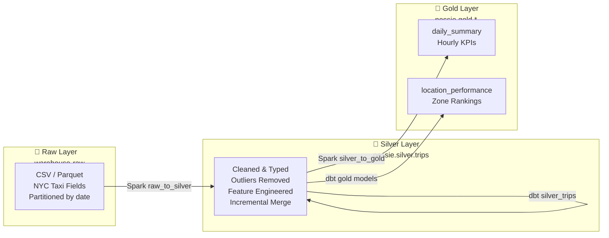

# Data Flow

Data moves through three medallion layers: Raw → Silver → Gold. Each layer has a distinct purpose and storage location.

---

## Flow Diagram

---

## Raw Layer (`warehouse-raw`)

- Raw CSV / Parquet files from NYC Taxi dataset
- Partitioned by `year=YYYY/month=MM/`
- Loaded by Airbyte connector OR Python ingest script
- Format: flat CSV with original taxi column names
- No transformations — exact copy of source data

---

## Silver Layer (`nessie.silver.trips`)

Cleaned, typed, and feature-engineered Iceberg table.

**Storage:** `s3://warehouse-silver/silver/trips/`
**Catalog:** `nessie.silver.trips`
**Partition:** `pickup_date` (day)
**Merge key:** `[vendor_id, tpep_pickup_datetime, pu_location_id]`

### Business rules applied

| Rule | Condition | Action |
|------|-----------|--------|
| Distance range | `0.1 ≤ trip_distance ≤ 200 mi` | Drop row if outside range |
| Fare range | `$1 ≤ fare_amount ≤ $500` | Drop row if outside range |
| Duration range | `1 ≤ trip_duration_minutes ≤ 300` | Drop row if outside range |

### Added feature columns

| Column | Description |
|--------|-------------|
| `trip_duration_minutes` | Computed from pickup/dropoff timestamps |
| `time_of_day` | `morning` / `afternoon` / `evening` / `night` based on pickup hour |
| `avg_speed_mph` | `trip_distance / (duration / 60)` |
| `tip_pct` | `tip_amount / fare_amount * 100` |
| `fare_per_mile` | `fare_amount / trip_distance` |
| `day_name` | Day of week name from pickup date |
| `is_weekend` | `true` if Saturday or Sunday |
| `payment_type_label` | Human-readable label for payment_type code |

---

## Gold Layer (`nessie.gold.*`)

Aggregated KPI tables optimized for analytics.

| Table | Grain | Key Metrics |
|-------|-------|-------------|
| `gold_daily_summary` | day + hour | trip_count, revenue, avg_fare, avg_distance, avg_duration, peak_hour flag |
| `gold_location_performance` | pickup location zone | trips per zone, avg revenue, rank |

**Storage:** `s3://warehouse-gold/gold/`
**Partition:** `gold_daily_summary` is partitioned by `date`
