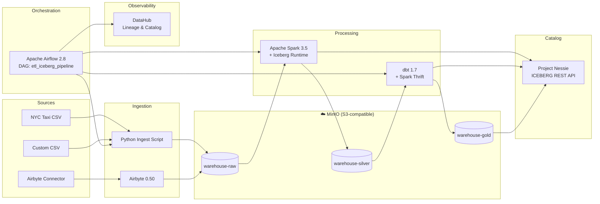
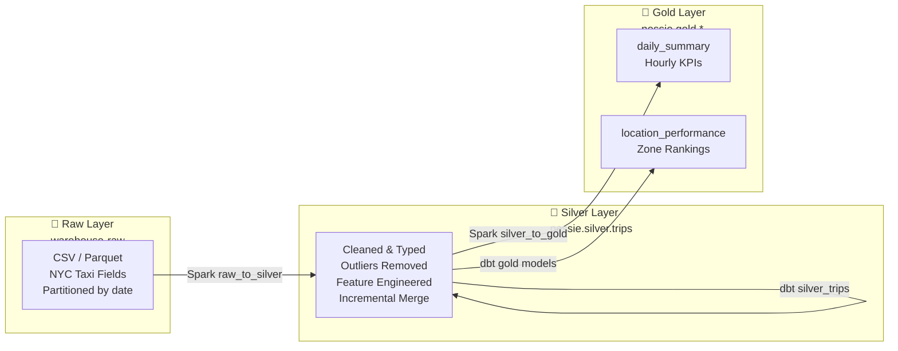
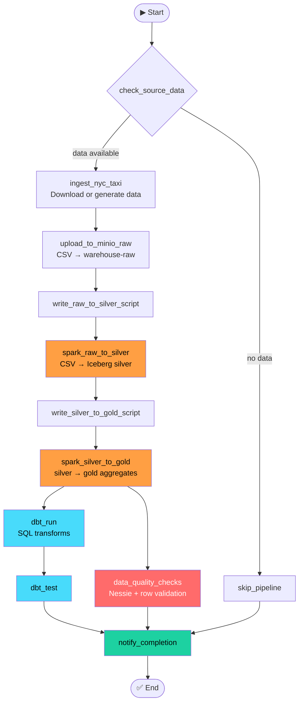
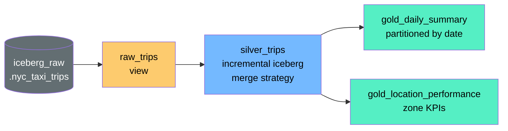

# Architecture Overview

The stack implements a classic medallion architecture (Raw → Silver → Gold) on top of Apache Iceberg, with Nessie providing Git-like catalog versioning and DataHub providing lineage observability.

---

## Main Architecture

**Layers:**

- **Sources** — NYC Taxi CSV files or custom data via Airbyte connectors
- **Ingestion** — Python scripts or Airbyte write raw data to MinIO `warehouse-raw`
- **Storage** — MinIO stores all Parquet/Iceberg files across raw/silver/gold buckets
- **Catalog** — Nessie tracks all Iceberg table metadata with branching support
- **Processing** — Spark runs raw→silver transforms; dbt runs silver→gold SQL models
- **Orchestration** — Airflow's `etl_iceberg_pipeline` DAG ties it all together
- **Observability** — DataHub's `datahub_lineage_emitter` DAG pushes lineage metadata after each run

---

## Medallion Layers

- **Raw** — unmodified source files, partitioned by `year=YYYY/month=MM/`
- **Silver** — cleaned, typed, enriched Iceberg table with business rules applied
- **Gold** — aggregated KPI tables optimized for analytics queries

---

## Airflow DAG

The DAG runs daily at 6am. It is paused at creation — toggle it on in the Airflow UI or trigger manually.

---

## dbt Lineage

dbt models are defined in `dbt/models/` and run against Spark Thrift Server on port 10001.
