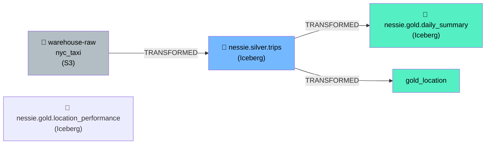

# Lineage & Metadata

The `datahub_lineage_emitter` Airflow DAG (defined in `airflow/dags/datahub_lineage_emitter.py`) emits three types of metadata to DataHub after each ETL run.

---

## Lineage Graph



Datasets registered in DataHub:

| URN | Name | Platform |
|-----|------|----------|
| `urn:li:dataset:(urn:li:dataPlatform:s3,warehouse-raw.nyc_taxi,PROD)` | NYC Taxi Raw Layer | S3 |
| `urn:li:dataset:(urn:li:dataPlatform:iceberg,nessie.silver.trips,PROD)` | NYC Taxi Silver Layer | Iceberg |
| `urn:li:dataset:(urn:li:dataPlatform:iceberg,nessie.gold.daily_summary,PROD)` | Gold Daily Summary | Iceberg |
| `urn:li:dataset:(urn:li:dataPlatform:iceberg,nessie.gold.location_performance,PROD)` | Gold Location Performance | Iceberg |

---

## DAG Tasks

The `datahub_lineage_emitter` DAG runs three tasks:

```
emit_dataset_metadata
    ├── emit_lineage
    └── emit_silver_schema
```

### `emit_dataset_metadata`

Registers all four datasets with `DatasetPropertiesClass`. Each dataset gets:
- `name` and `description`
- Custom properties: `stack=iceberg-etl`, `catalog=nessie`, `storage=minio`

### `emit_lineage`

Declares upstream relationships using `UpstreamLineageClass`:
- `silver ← raw` (TRANSFORMED)
- `gold_daily ← silver` (TRANSFORMED)
- `gold_location ← silver` (TRANSFORMED)

### `emit_silver_schema`

Pushes 17-column schema for `nessie.silver.trips` using `SchemaMetadataClass`:

| Column | Type |
|--------|------|
| `vendor_id` | String |
| `tpep_pickup_datetime` | Date |
| `tpep_dropoff_datetime` | Date |
| `trip_distance` | Number |
| `fare_amount` | Number |
| `tip_amount` | Number |
| `total_amount` | Number |
| `tip_pct` | Number |
| `fare_per_mile` | Number |
| `avg_speed_mph` | Number |
| `trip_duration_minutes` | Number |
| `time_of_day` | String |
| `day_name` | String |
| `is_weekend` | String |
| `payment_type_label` | String |
| `pu_location_id` | Number |
| `do_location_id` | Number |

---

## REST Emitter

All metadata is sent via `DatahubRestEmitter` pointing at `http://datahub-gms:8080` (internal Docker DNS). The emitter wraps every dataset update in a `MetadataChangeEventClass` (MCE) — DataHub's primary metadata ingestion protocol.

The emitter tests connectivity before emitting with `emitter.test_connection()`. If DataHub is unreachable (e.g., not started), `get_emitter()` returns `None` and all tasks silently skip — the ETL pipeline is never blocked.
