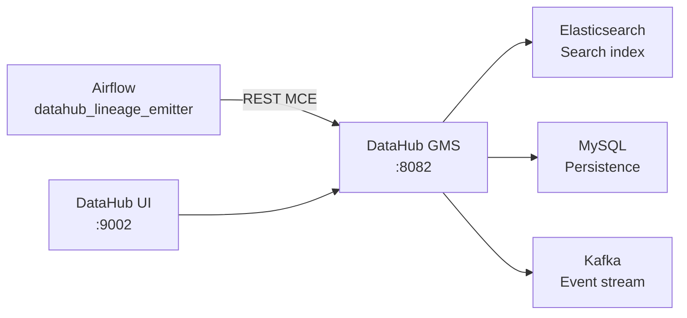

# DataHub Overview

DataHub is the metadata observability layer in this stack. It provides a searchable UI for data lineage, schema discovery, and dataset documentation.

---

## Why DataHub?

The stack already has two catalog systems:

| System | Role |
|--------|------|
| **Project Nessie** | Operational Iceberg catalog — tracks table snapshots, branches, schema versions. Used at query time by Spark and dbt. |
| **DataHub** | Observability catalog — tracks dataset lineage, ownership, schema documentation, and cross-pipeline dependencies. Used by engineers and analysts to understand data. |

These are complementary, not competing:

- Nessie answers "what does this table look like right now, and what did it look like yesterday?"
- DataHub answers "where did this data come from, what transformations touched it, and who owns it?"

---

## What DataHub Adds

| Capability | Description |
|------------|-------------|
| **Lineage graph** | Visual graph of raw → silver → gold dependencies |
| **Schema browser** | Column-level metadata for all datasets |
| **Dataset search** | Full-text search across all registered datasets |
| **Ownership** | Tag datasets with owners and teams |
| **Custom properties** | Attach arbitrary metadata (stack, catalog, storage) |

---

## Architecture

DataHub runs as a sidecar stack on `etl-network`. The Airflow `datahub_lineage_emitter` DAG emits metadata after each ETL run using the DataHub REST emitter.

**Emission flow:**

1. `emit_dataset_metadata` — registers all four datasets (raw, silver, gold_daily, gold_location) with names and descriptions
2. `emit_lineage` — declares upstream relationships: `raw → silver → gold_daily`, `silver → gold_location`
3. `emit_silver_schema` — pushes column-level schema for the silver trips table

All tasks fall back gracefully if DataHub GMS is unreachable (returns `None` from `get_emitter()`), so the ETL pipeline is never blocked by DataHub being down.

---

## Services

| Service | Purpose | Port |
|---------|---------|------|
| `datahub-gms` | Metadata graph service (REST API) | 8082 |
| `datahub-frontend` | React UI | 9002 |
| `datahub-kafka` | Event streaming | internal |
| `datahub-schema-registry` | Kafka schema registry | internal |
| `datahub-elasticsearch` | Search indexing | internal |
| `datahub-mysql` | Persistent metadata store | internal |
| `datahub-zookeeper` | Kafka coordination | internal |
