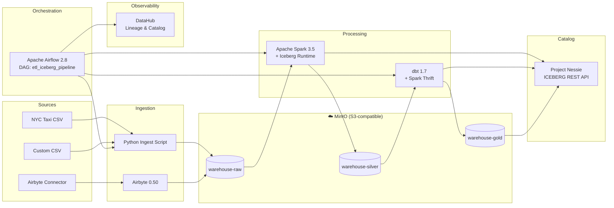

# Local Apache Iceberg ETL Stack

A production-grade local ETL stack built on Apache Iceberg — runs entirely on your laptop or Mac Mini.

**Key links:** [Airflow](http://localhost:8080) · [MinIO](http://localhost:9001) · [Nessie API](http://localhost:19120/api/v1) · [Spark UI](http://localhost:8090) · [DataHub](http://localhost:9002)

---

## Architecture

---

## Get Started

- **Quick Start**

    New here? Start the full stack in one command.

    [→ Quick Start](getting-started/quickstart.md)

- **Local Demo (No Docker)**

    Try the pipeline instantly with Node.js — no Docker needed.

    [→ Local Demo](use-cases/local-demo.md)

- **Architecture Deep Dive**

    Understand the medallion layers, components, and data flow.

    [→ Architecture Overview](architecture/overview.md)

- **DataHub Integration**

    Explore data lineage and metadata observability.

    [→ DataHub Setup](datahub/setup.md)

---

## What's in the Stack

| Component | Version | Purpose |
|-----------|---------|---------|
| MinIO | 2024-01-18 | S3-compatible Iceberg warehouse |
| Project Nessie | 0.76.3 | Iceberg REST catalog + Git-like versioning |
| Apache Spark | 3.5.0 | Distributed processing engine |
| Apache Airflow | 2.8.0 | Pipeline orchestration |
| Airbyte | 0.50.45 | Data ingestion |
| dbt | 1.7.2 | SQL transformations |
| DataHub | head | Data lineage & metadata catalog |

Full details → [Components](architecture/components.md)
