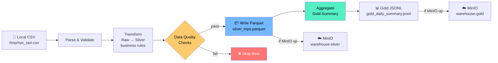

# Use Case 0: Local Demo (No Docker)

**Best for:** trying the pipeline instantly, understanding the transform logic, CI without Docker.

**Requirements:** Node.js ≥ 18, `npm install parquetjs-lite` (or runs with JSONL fallback)

---

## Step 1 — Install Dependency (optional, for real Parquet output)

```bash
cd opensource_etl_stack
npm install parquetjs-lite
```

## Step 2 — Run the Demo

```bash
# Generate synthetic data + run full pipeline (no MinIO needed)
node scripts/local_etl_demo.js --generate

# Use your own CSV
node scripts/local_etl_demo.js --csv /path/to/your/file.csv

# With MinIO running: also uploads to warehouse-raw / warehouse-silver / warehouse-gold
docker compose up -d minio && docker compose up minio-init
node scripts/local_etl_demo.js --generate
```

---

## What It Does



1. **Generate** — creates 1,000 synthetic NYC taxi rows (or reads your CSV)
2. **Upload raw** — pushes CSV to `s3://warehouse-raw/nyc_taxi/year=.../month=.../` (if MinIO up)
3. **Transform** — applies all silver business rules: type casting, outlier removal, feature engineering (`time_of_day`, `avg_speed_mph`, `tip_pct`, `fare_per_mile`, etc.)
4. **Data quality checks** — asserts trip_distance, fare_amount, duration all in valid ranges
5. **Write Parquet** — outputs `silver_trips.parquet` (~200 KB for 1k rows)
6. **Upload silver** — pushes Parquet to `s3://warehouse-silver/silver/trips/` (if MinIO up)
7. **Gold aggregation** — computes hourly revenue/trip KPIs
8. **Write gold** — outputs `gold_daily_summary.jsonl`

---

## Expected Output

```
✓ Generated synthetic CSV: /tmp/nyc_taxi_demo.csv
✓ Parsed 1000 raw rows from CSV
✓ Transformed 1000 rows (filtered 0 bad rows)
✓ DQ: all trip_distance values in range (0–200 mi)
✓ DQ: all fare_amount values in range ($0–$500)
✓ DQ: all trip_duration_minutes in range (0–300 min)
✓ DQ: time_of_day feature correctly computed
✓ Silver file written: /tmp/silver_trips.parquet (198.9 KB)
✓ Gold aggregation: 509 hourly buckets across 28 days
✓ Total trips: 1,000
✓ Total revenue: $44,262.56
✓ Gold file written: /tmp/gold_daily_summary.jsonl

✅ Pipeline complete!  Passed: 13  Failed: 0  Skipped: 2
```
